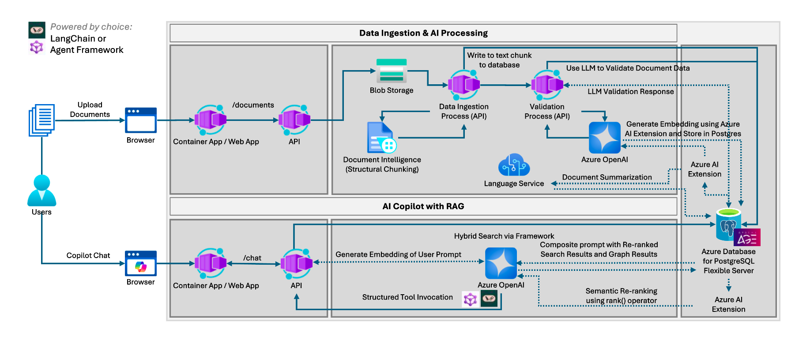
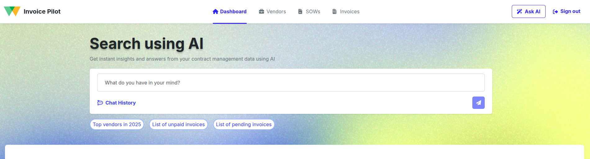
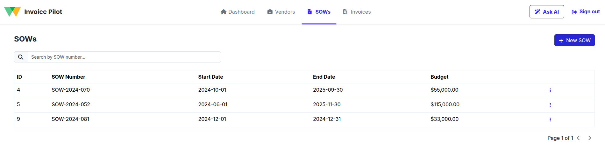
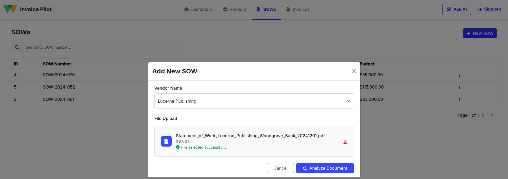
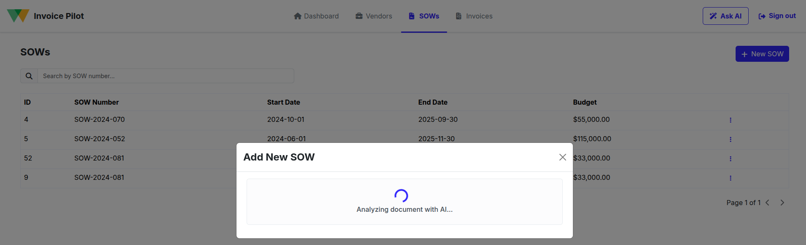
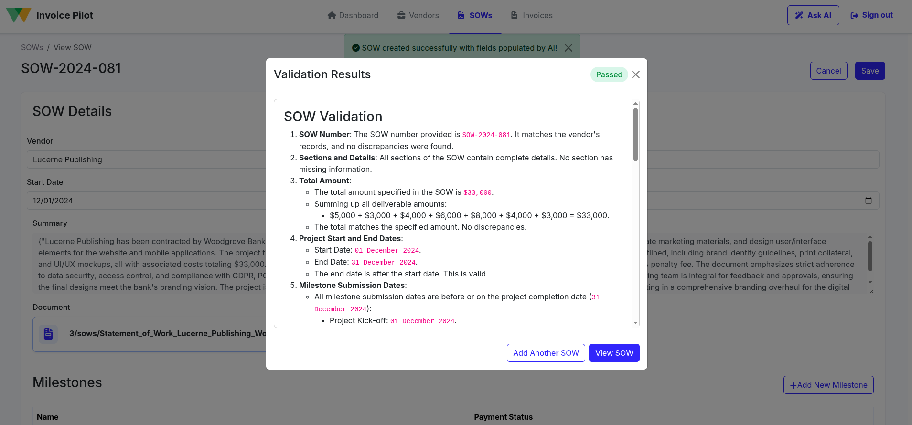
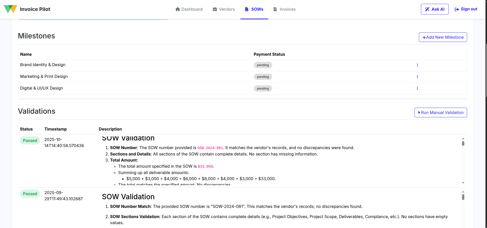
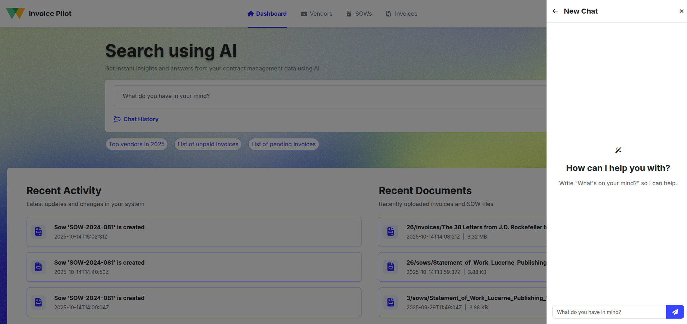
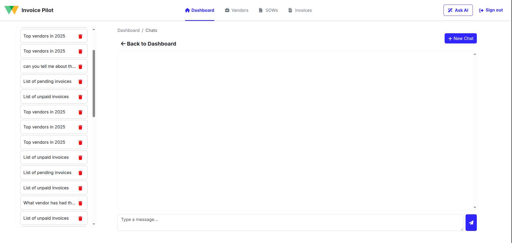

# 🏦 PostgreSQL Solution Accelerator: Invoice Pilot

Inovice Pilot is an **AI-driven financial document validation platform** that showcases how **advanced PostgreSQL features**, powered by [LangChain](https://www.langchain.com/) and Azure AI services, can drive **intelligent document processing and validation** using unstructured financial data like invoices and statements of work (SOWs). This demo runs fully on Azure, and can be deployed quickly using the **Azure Developer CLI**.

Explore how intelligent AI agents handle document extraction, validation, semantic search, and financial insights with PostgreSQL's advanced vector capabilities and Azure AI integration.

[](https://github.com/codespaces/new?hide_repo_select=true&ref=dev&repo=1013163299&machine=standardLinux32gb&devcontainer_path=.devcontainer%2Fdevcontainer.json&location=WestUs2)
[](https://vscode.dev/redirect?url=vscode://ms-vscode-remote.remote-containers/cloneInVolume?url=https://github.com/EmumbaOrg/postgres-sa-byoac)

> The full documentation for deploying and completing the workshop can be found here:
> <http://aka.ms/pg-byoac-docs/>

## 🧭 Quick Navigation
- [App Scenario](#app-scenario-ai-powered-financial-document-intelligence)
- [Architecture Overview](#architecture-overview)
- [Solution Accelerator Deployment](#-solution-accelerator-deployment)
- [AI-Powered Document Processing Workflow](#-ai-powered-document-processing-workflow)
- [Invoice Pilot Walkthrough](#-invoice-pilot-walkthrough)
- [Chatbot Features](#-chatbot-features)
- [Understanding Supported Document Types](#-understanding-supported-document-types-and-validation-rules)

## App Scenario: AI-Powered Financial Document Intelligence

**Invoice Pilot** is an AI-powered financial document validation platform that showcases how advanced PostgreSQL features and AI can deliver intelligent document processing and validation.

Built on **LangChain** and **Azure AI services**, the app leverages:

- **`pg_diskann`** for fast vector search over financial document data
- **`azure_ai`** for in-database semantic re-ranking and AI operations
- **Apache AGE** to model document relationships as knowledge graphs
- **Azure Document Intelligence** for structured document extraction

The platform also features an **AI Financial Chatbot**, providing real-time insights into vendor performance, SOW compliance, and invoice validation—helping financial teams understand document accuracy and vendor relationships.

### 🎯 Primary Use Cases

1. **Automated Document Text Extraction** 
   Leverages Azure Document Intelligence to automatically extract and structure text from uploaded PDF documents into machine-readable formats for AI analysis.

2. **Automated Document Validation**
   An AI-powered workflow built using `LangChain` agents validates invoices against statements of work, checking compliance, billing accuracy, and payment terms in real time.

3. **Financial Chatbot**
   A smart assistant that answers questions about vendors, SOWs, and invoices using vector search and semantic understanding to provide contextual financial insights.

Using a curated financial dataset (SOWs, invoices, vendor profiles), the platform enables:

- 📄 **Automated document extraction** from PDFs using Azure Document Intelligence
- 🔍 **Semantic document search** with vector embeddings
- ✅ **AI-driven validation** using LangChain agents
- 🧠 **Financial insights** via chatbot queries
- 📊 **Compliance monitoring** through automated SOW-invoice matching

The result is an intelligent and automated financial document processing system where AI agents dynamically interpret, validate, and analyze financial documents—whether it's checking invoice accuracy, analyzing vendor performance, or ensuring SOW compliance.

## Architecture Overview

The following image shows the high-level architecture of the solution, highlighting how various Azure services and PostgreSQL extensions work together to power the intelligent financial document processing experience.



### 🧩 Key Components

- **Frontend**:
  - React (SPA) with TypeScript hosted on **Azure Container Apps**
  - Includes document upload, validation results, and financial chatbot interface

- **Backend**:
  - **FastAPI** for API orchestration and document processing logic
  - **Azure OpenAI (GPT-4o and text-embedding-ada-002)** for AI reasoning and embeddings
  - **Azure App Configuration** for environment variables management
  - **Apache AGE Extension** for graph-based document relationships
  - **pg_diskann Extension** for high-performance vector search
  - **azure_ai Extension** for in-database AI operations
  - **Azure Blob Storage** for document storage and workflow triggers
  - **Azure Language Service** for additional NLP capabilities
  - **Azure Document Intelligence** for PDF document extraction

### 🏗️ Infrastructure Summary

The solution is deployed entirely within a single **Azure Resource Group** and uses the following core infrastructure:

- **Azure Container Apps Environment**
- **Azure OpenAI Service**
- **Azure Database for PostgreSQL Flexible Server**
- **Azure Document Intelligence**
- **Azure Blob Storage**
- **Azure App Configuration**
- **Azure Language Service**
- **Bicep Templates**

## 🚀 Solution Accelerator Deployment

### 🧰 Prerequisites

The following are prerequisites for deploying this solution:

1. [Azure Developer CLI](https://learn.microsoft.com/azure/developer/azure-developer-cli/install-azd?tabs=winget-windows%2Cbrew-mac%2Cscript-linux&pivots=os-linux)
2. [Azure CLI](https://learn.microsoft.com/cli/azure/install-azure-cli)
3. An Azure account with an active subscription.
4. [Powershell Core](https://learn.microsoft.com/powershell/scripting/install/installing-powershell?view=powershell-7.5)
5. Appropriate roles attached to user for solution deployment (`Contributor` role and `Role Based Admin Control Administrator` role for the subscription)
6. [Git](https://git-scm.com/)

### 🛠️ Deployment Steps

#### Clone the Repository

Clone the repository. Once done, navigate to the repository:

```sh
git clone https://github.com/EmumbaOrg/postgres-sa-byoac.git
cd postgres-sa-byoac
```

#### Log in to your Azure account

To log in to Azure CLI, use the following command. You can use the `--use-device-code` flag if the command fails.

```sh
az login
```

To log in to Azure Developer CLI, use this command. You can use the `--use-device-code` flag if the command fails.

```sh
azd auth login
```

#### Create a new Azure Developer environment

In the root of the project, execute the following command to create a new `azd` environment. Provide a name for your `azd` environment:

```sh
azd env new
```

#### **Windows Users Only – Grant permissions to azd hook scripts**

> **⚠️ IMPORTANT:** This step is **only** required if you are deploying from **Windows**.
> **Mac** and **Linux** users can skip this — nothing needs to be done.

If you are on **Windows**, run the following command in your current terminal session to allow execution of `pwsh` scripts located in the `azd-hooks` directory:

```powershell
Set-ExecutionPolicy -Scope Process -ExecutionPolicy Bypass
```

#### Solution Deployment


1. Run the following command to provision the resources:

    ```sh
    azd up
    ```

    Once the above command is executed, the `azd` workflow prompts user to select the subscription for deployment and location.

2. Make sure that you have enough Azure OpenAI model quota in the region of deployment. **The `azd` workflow automatically filters and shows the region where the Azure OpenAI quota is available.** The Azure OpenAI quota required for `GlobalStandard` **deployment type** for this solution is listed below. This configuration can be changed from the `main.parameters.json` file in the `infra` directory using the following parameters:

    - **`GlobalStandard` GPT-4o:** 10K TPM - `AZURE_OPENAI_CHAT_DEPLOYMENT_CAPACITY`
    - **`GlobalStandard` text-embedding-ada-002:** 10K TPM - `AZURE_OPENAI_EMBED_DEPLOYMENT_CAPACITY`


    ```sh
    @metadata({
      azd: {
        type: 'location'
        usageName : [
          'OpenAI.GlobalStandard.gpt-4o, 10'
          'OpenAI.Standard.text-embedding-ada-002, 10'
        ]
      }
    })
    ```

3. Before the `azd` workflow proceeds, checks are performed in the selected infra region and recommendations are generated on failure for following cases to ensure that the deployment is successful.
    - Azure CLI login
    - Azure Flexible Server for PostgreSQL SKU [we recommend avoiding burstable instances as they might result in "Illegal Instruction" error in certain regions for vector queries]
    - Azure Container Apps quota
    - azd env name

The deployment might take several minutes. Progress updates will be displayed in the terminal and can also be tracked via the Azure Portal.

Once the deployment is complete, `azd` will output the **application URLs** for the deployed services.

### 🧹 Tear Down

To destroy all the resources that have been created in the steps above, as well as remove any accounts deployed by the solution accelerator, use the following command:

```sh
azd down --purge
```

The `--purge` flag deletes all the accounts permanently.

### 🛟 Troubleshooting

1. The [troubleshooting guide](https://learn.microsoft.com/azure/developer/azure-developer-cli/troubleshoot?tabs=Browser) for `azd cli`.
2. A validation error occurs when unsupported characters, such as `_`, `#` etc. are used while initializing or creating a new environment or resources. Refer to [rules and restrictions](https://learn.microsoft.com/azure/azure-resource-manager/management/resource-name-rules) for naming conventions.
3. A scope error occurs when the user does not have appropriate permissions when deploying resources through `azd` workflow. Attach `Contributor` role and `Role Based Access Control Administrator` role to user permissions before deploying the solution accelerator.
4. When `The resource entity provisioning state is not terminal. Please wait for the provisioning state to become terminal and then retry the request` error occurs, restart the deployment using the `azd up` command.

### 📝 Additional Notes

- Ensure all services are running and accessible at their respective ports.
- If you encounter issues, check the logs for each service and verify your environment variables.
- For troubleshooting Azure deployments, refer to the [Azure Developer CLI troubleshooting guide](https://learn.microsoft.com/azure/developer/azure-developer-cli/troubleshoot).
- PostgreSQL extensions (pgvector, Apache AGE, DiskANN, azure_ai) are automatically configured during deployment.

## 🤖 AI-Powered Document Processing Workflow

PostgreSQL Solution Accelerator uses a comprehensive AI-driven workflow built on **LangChain** and **Azure AI services** to process and validate financial documents. The system handles document extraction, validation, and intelligent querying through specialized AI agents.

### 🧠 Key AI Agents & Processing Components

- **Document Extraction**: Uses Azure Document Intelligence to extract structured data from PDF invoices and SOWs
- **SOW Validation Agent**: Ensures statements of work contain all required sections and proper milestone definitions
- **Invoice Validation Agent**: Validates invoices against corresponding SOWs, checking compliance, amounts, and payment terms
- **Chatbot**: Provides intelligent responses to queries about vendors, documents, and financial insights

These agents work together through structured workflows, providing transparency, error handling, and consistent processing of financial documents.

### 🔄 Document Processing Pipeline

The system processes documents through the following stages:

1. **Document Upload & Storage**: Documents are uploaded to Azure Blob Storage, triggering automated processing
2. **AI Document Extraction**: Azure Document Intelligence extracts text and structure from PDF documents
3. **Content Structuring**: LangChain agents format extracted content into standardized JSON structures
4. **Vector Embedding**: Document content is converted to vector embeddings using Azure OpenAI
5. **Database Storage**: Structured data and embeddings are stored in PostgreSQL with specialized extensions
6. **Validation Processing**: AI agents validate documents against business rules and cross-reference with related documents
7. **Graph Relationship Building**: Apache AGE creates knowledge graphs linking documents, vendors, and milestones

### 🧬 Vector Search & Semantic Capabilities

The system uses **pg_diskann** to enable advanced search capabilities:

- Document embeddings are generated automatically using triggers on data insertion
- Vector similarity search finds related documents and content
- Semantic re-ranking improves search result quality using **azure_ai** extension
- Graph queries through **Apache AGE** reveal complex document relationships

> Agent prompts can be modified in [`src/api/app/prompts/`](src/api/app/prompts/) to customize validation rules, output formats, or processing logic.

## 🏦 Invoice Pilot Walkthrough

Experience how Invoice Pilot (PostgreSQL Solution Accelerator) delivers automated financial document processing and validation:

### 1. Access the Application Interface

Start by accessing the frontend application using the URL that was output during the `azd up` deployment. This will open the financial document management interface where you can explore all the platform's capabilities.

### 2. Navigate to the Main Dashboard

Once the application loads, you'll see the main dashboard which provides an overview of your financial documents, validation statistics, and quick access to key features.



### 3. Access the SOW Management Tab

Click on the "SOW" tab in the navigation menu to access the Statement of Work management section where you can view existing SOWs and add new ones.



### 4. Initiate New SOW Creation

Click on the "Add new SOW" button to start the process of uploading and processing a new Statement of Work document.


### 5. Upload SOW Document

Select the appropriate vendor from the dropdown menu and select your SOW document. The system supports PDF files. Click on "Analyze Document" button, to start analysis and validation pipeline.



### 6. Monitor Analysis and Validation Process

Wait for the AI-powered analysis and validation process to complete. You'll see progress indicators as the system extracts content, generates embeddings, and runs validation rules against the document.



### 7. Review Validation Results

Once processing is complete, a pop-up will display the SOW validation results showing validation status, any issues found, and detailed feedback. After reviewing the results, click the "View SOW" button to access the detailed document view.



### 8. Explore Extracted SOW Information

The SOW detail page displays comprehensive information extracted from the document including project name, summary, milestones, payment terms, and deliverables. You can also view the complete validation history for this document.



### 9. Trigger Manual Re-validation

If needed, you can click the "Run Manual Validation" button to trigger the validation process again. This is useful when you want to recheck compliance or when validation rules have been updated.


This walkthrough showcases how the solution delivers comprehensive, AI-powered financial document intelligence with full transparency into validation processes and document relationships.

> 💡 You can follow similar steps in the invoices management tab to configure the invoice validation pipeline and view its validation results. The process and interface patterns are consistent across both payment and invoice validation workflows.


## 🧠 Chatbot Features

PostgreSQL Solution Accelerator includes a powerful **Financial AI Chatbot** that interprets queries about vendors, SOWs, and invoices, providing intelligent insights into financial document relationships and compliance.

The chatbot is equipped with comprehensive knowledge about:

| Capability | Purpose |
|------------|---------|
| `SOW Validation` | Analyzes statement of work details, milestones, and deliverables |
| `Invoice Validation` | Reviews invoice accuracy, compliance, and billing discrepancies |
| `Performance Insights` | Evaluates vendor performance based on validation results and delivery timeliness |


### 🤖 Accessing the Financial AI Chatbot

1. **Dashboard Chat Interface**
   
   From the main dashboard, you can quickly start a conversation with the AI Financial Assistant in two ways:
   - Type your question in the "Search using AI" field and click the send button to navigate to the full chat interface
   - Click the "Ask AI" button in the top-right corner to open a convenient side drawer for quick queries without leaving the current page

   

   

2. **Full Chat Experience**
   
   The dedicated chat page provides a comprehensive conversational experience with:
   - **Chat History Panel**: View and resume previous conversations from the left sidebar
   - **Interactive Chat Interface**: Full-featured messaging with the AI assistant in the main area
   - **Context-Aware Responses**: The AI maintains conversation context and can reference previous queries

   


### 🔍 Try These Chatbot Queries

- **Vendor Information**
  Query: `"Tell me about Adatum Corporation"`
  → The chatbot provides vendor details, contact information, service types, and associated documents.

- **SOW Analysis**
  Query: `"What are the milestones for the Lucerne Publishing project?"`
  → The chatbot analyzes SOW structure, deliverables, and payment schedules.

- **Compliance Monitoring**
  Query: `"Which invoices have validation issues?"`
  → The chatbot reviews validation results and highlights discrepancies or compliance problems.

- **Performance Assessment**
  Query: `"Tell me about the accuracy of unpaid invoices from Adatum."`
  → The chatbot provides summary on the accuracy of unpaid invoices from Adatum.


> ⚠️ The chatbot is designed specifically for Woodgrove Bank's vendor and document management, focusing on SOWs, invoices, and vendor relationships. It provides accurate insights based on the validation results and document analysis performed by the AI agents.

## 🔍 Understanding Supported Document Types and Validation Rules

PostgreSQL Solution Accelerator supports intelligent processing of **financial documents** with comprehensive validation rules. To get meaningful results, it's important to understand what document types are supported and how the AI validation system works.

### ✅ Supported Document Categories

The system currently supports **two primary document types**:

- 📄 **Statements of Work (SOWs)** - Contract documents defining project scope, milestones, and payment terms
- 🧾 **Invoices** - Billing documents that reference SOW milestones and deliverables

> ❌ Other document types (purchase orders, contracts, receipts) are not currently supported for automated processing.

You can view sample documents in the [`data/sample_docs/`](data/sample_docs/) directory to understand the expected format and structure.

---

### 🧠 Document Processing Types and Validation

PostgreSQL Solution Accelerator supports comprehensive document analysis via distinct AI agents:

#### 1. 📄 SOW (Statement of Work) Validation

Used for **contract document analysis**, including:

- Project scope and objectives validation
- Milestone and deliverable verification
- Payment terms and schedule validation
- Required section completeness check

**Validation Criteria:**
- All required sections must be present (scope, objectives, tasks, schedules, payments)
- Project end date must be after start date
- Milestone submission dates must be before project completion
- Payment amounts must match deliverable values
- Proper signatures and compliance sections required

---

#### 2. 🧾 Invoice Validation

Used for **billing document verification**, including:

- Invoice-to-SOW milestone matching
- Amount and billing accuracy verification
- Payment terms compliance checking
- Late fee and penalty calculations

**Validation Rules:**
- Invoice amounts must match SOW milestone values
- Milestone delivery dates must be on or before due dates
- Late penalties applied according to SOW terms
- Line items must correspond to valid SOW deliverables
- Payment terms consistency between invoice and SOW

---

### ❌ Why Some Documents May Fail Validation

**Invoice Example**: `"Invoice missing SOW reference number"`

This might fail because:
- **SOW Number** is missing or incorrect in the invoice
- Referenced **milestone** doesn't exist in the corresponding SOW
- **Amount discrepancies** between invoice and SOW
- **Late delivery** triggering penalty calculations
- **Payment terms** differ from the original SOW

---

### 📌 Document Relationship Importance

The system relies on **document relationships** for comprehensive validation:

If an invoice references a SOW that hasn't been processed or doesn't exist, validation may be incomplete—even if the invoice format is correct.

---

## 🧪 Sample Financial Scenarios

Use the examples below to test how different validation processes behave:

### 📄 SOW Validation Examples

(*Sample statements of work for testing*)

- "Adatum Corporation SOW for database modernization project"
- "Lucerne Publishing content management system SOW"
- "VanArsdel Ltd financial system integration SOW"

### 🧾 Invoice Validation Examples

(*Sample invoices that reference SOW milestones*)

- "Invoice INV-AC2024-001"
- "Invoice INV-LP2024-002"
- "Invoice INV-VL2024-003"

### 🧠 Chatbot Query Examples

(*Financial intelligence queries*)

- "What IT vendors are we working with?"
- "Show me all SOWs with milestone delivery issues"
- "What vendor has had the most invoicing issues?"
- "Tell me about the accuracy of unpaid invoices from Adatum."

---

> 💡 If a document is missing required sections or has validation errors, the system provides detailed feedback about specific issues found, including dollar amounts, dates, and compliance requirements.
