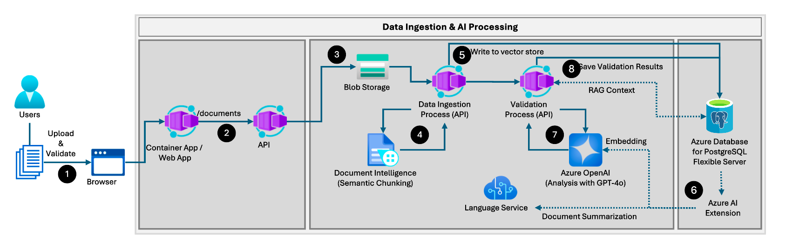
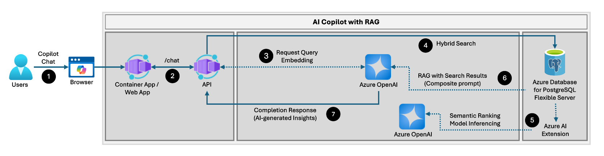

# 1.2 Application Architecture

The **Invoice Pilot** application automates the extraction, validation, and storage of data from invoices and Statements of Work (SOWs) to reduce manual effort and increase operational efficiency. It eliminates repetitive data-entry tasks, minimizes human error, and empowers internal users to derive actionable insights from validated financial data—enhancing both accuracy and decision-making across the organization.

> **Note**  
> The architecture is flexible and can be adapted to custom datasets beyond the pre-configured sample data included in the accelerator. When extending the solution to your own data, review the database schema, ingestion pipelines, and indexing strategies for compatibility. Guidance on making such adjustments is provided in the documentation.

---

## Overall Architecture

The **Invoice Pilot** solution is composed of a React Single Page Application (SPA) for the frontend, a Python FastAPI backend, and a set of Azure services that handle document ingestion, AI-based extraction, validation, and retrieval.  
The following diagram shows the high-level architecture:

> **Tip — Decoupled Architecture**  
> Separating the UI and backend services improves maintainability and scalability.  
>
> - The React + Node.js frontend provides an intuitive, responsive interface for uploading and reviewing documents.  
> - The FastAPI backend delivers high-performance asynchronous data processing and API orchestration.  
> - This separation allows independent deployment, better security isolation, and optimized resource allocation across Azure Container Apps and supporting services.

---

## Application Data Flow

The data flow within **Invoice Pilot** can be viewed through two major components:

---

### **Data Ingestion & AI Processing**

Internal users and external vendors upload documents, SOWs, and invoices via the browser-based portal. From that point onward, automation handles all extraction, validation, and storage operations.

1. **Document Upload** – Users submit invoices and SOWs through the React SPA interface.  
2. **Backend API Integration** – The frontend calls the FastAPI backend’s `/documents` endpoint.  
3. **Blob Storage Persistence** – The backend, hosted as an [Azure Container App](https://learn.microsoft.com/azure/container-apps/overview), stores uploaded documents in Azure Blob Storage.  
   - Original files are preserved for auditing or re-processing.  
4. **AI Extraction Pipeline** – On new uploads, the backend invokes **Azure AI Document Intelligence** to extract key information.  
   - AI models capture payment milestones, due dates, billable amounts, and vendor details.  
   - **Semantic Chunking** structures content into meaningful paragraphs and sentences for downstream RAG queries.  
5. **Database Storage** – Extracted data and metadata are written into **Azure Database for PostgreSQL – Flexible Server**.  
6. **GenAI Augmentation via azure_ai Extension** – During insertion:  
   - Vector embeddings are generated using Azure OpenAI’s `text-embedding-ada-002`.  
   - Summaries of SOW documents are created with Azure AI Language Service.  
7. **AI-Driven Validation** – Azure OpenAI GPT-4o analyzes extracted data for consistency and compliance.  
   - The RAG pattern cross-references invoices with corresponding SOWs, checking milestone completion, billing accuracy, and contractual language.  
8. **Validation Storage** – Results are stored and vectorized within the same PostgreSQL instance for future semantic retrieval.

---

### **AI Copilot with RAG**

The intelligent copilot enables users to query the system conversationally and receive contextual responses grounded in enterprise data.

1. **User Interaction** – Users ask questions through the Copilot chat in the web portal.  
2. **API Request** – Messages are sent to the `/chat` endpoint on the FastAPI backend.  
3. **Query Embedding** – The backend generates vector embeddings using `text-embedding-ada-002`.  
4. **Hybrid Search** – The PostgreSQL Flexible Server performs combined full-text and vector searches.  
   - Hybrid search merges keyword matching with semantic similarity for greater accuracy.  
   - This dual approach supports semantic search, recommendation, and intelligent discovery scenarios.  
5. **Semantic Ranking** – The `azure_ai` extension can invoke model inference to re-rank results by relevance before passing them to the RAG context.  
6. **Response Generation** – Azure OpenAI uses the composite prompt—system prompt + retrieved context—to formulate a grounded answer.  
7. **User Response** – The generated completion is returned to the React SPA, giving users immediate, data-backed insights into vendor performance and invoice compliance.

---

This architecture demonstrates how Azure services, database extensions, and generative AI models can operate together to deliver a modern, intelligent document-validation solution that is both scalable and adaptable for enterprise use.
