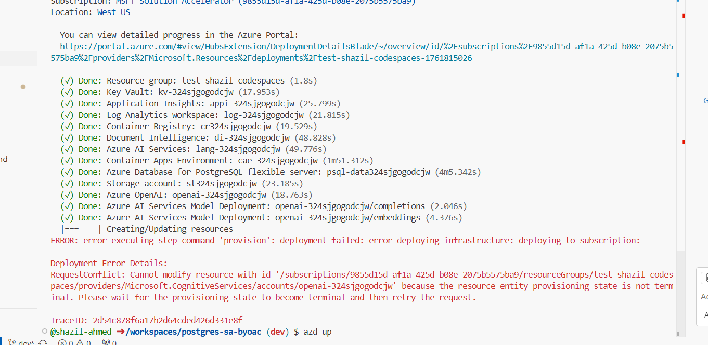

# 2.4 Provision and Deploy

You will need a valid Azure subscription, a GitHub account, and access to relevant Azure OpenAI models to complete this lab. Review the [prerequisites](./01-Prerequisites.md) section if you need more details.

## Start Docker Desktop

Docker Desktop is used to create and deploy the containers used for running the _Invoice Pilot Portal and API_ applications. It must be running before you begin the deployment process using `azd up`.

1. Launch Docker Desktop from the applications menu on your computer.

2. Look for the Docker icon in your system tray or menu bar to confirm it is running.

## Build and Open Dev Container

In this step you will open and build your dev container in VS Code.  After you complete this, you can complete the remaining steps in this page by running all commands inside
your dev container command line not your local operating system command line.

1. Open VS Code
2. Open Folder of your locally cloned repo
3. Press `Ctrl+Shift+P` to open the command palette
4. Type: `Dev Container` and choose "Rebuild and Reopen in Container"

!!! info "Dev Container Build Process"

    This will kick off a docker build process where your dev container will be built by docker desktop.  Let this process run, it may take a few minutes the first time.
    You will see VS Code flash and load into a new project environment.  Once the process completes, you can open a new terminal in VS Code.  You will notice the shell will
    look a little different as now you are in an Ubuntu Linux Container.

    From here on out in the documentation, run your commands in the dev container shell.  Except for tools like pgAdmin, you will
    still run these in your main operating system not the dev container.

## Authenticate With Azure

Before running the `azd up` command, you must authenticate your VS Code environment to Azure.

1. To create Azure resources, you need to be authenticated from VS Code. Open a new integrated terminal in VS Code. Then, complete the following steps:

### Authenticate with `az` for post-provisioning tasks

1. Log into the Azure CLI `az` using the command below.

    <!-- markdownlint-disable MD046 -->
    ```bash  title=""
    az login
    ```

2. Complete the login process in the browser window that opens.

    !!! info "If you have more than one Azure subscription, you may need to run `az account set -s <subscription-id>` to specify the correct subscription to use."

### Authenticate with `azd` for provisioning & managing resources

1. Log in to Azure Developer CLI. This is only required once per-install.

    ```bash title=""
    azd auth login
    ```

## Provision Azure Resource and Deploy App (UI and API)

You are now ready to provision your Azure resources and deploy the Invoice Pilot solution.

1. Use `azd up` to provision your Azure infrastructure and deploy the web application to Azure.

    ```bash title=""
    azd up
    ```

    !!! info "You will be prompted for several inputs for the `azd up` command:"

        - **Enter a new environment name**: Enter a value, such as `dev`.
        - The environment for the `azd up` command ensures configuration files, environment variables, and resources are provisioned and deployed correctly.
        - Should you need to delete the `azd` environment, locate and delete the `.azure` folder at the root of the project in the VS Code Explorer.
        - **Select an Azure Subscription to use**: Select the Azure subscription you are using for this workshop using the up and down arrow keys.
        - **Select an Azure location to use**: Select the Azure region into which resources should be deployed using the up and down arrow keys.       
        - **Enter a value for the `resourceGroupName`**: Enter `rg-postgresql-accelerator`, or a similar name.

2. On successful completion you will see a `SUCCESS: ...` message on the console.

    !!! danger "Resource Provisioning Conflict Error"
        Occasionally, you might run into this error while deploying. This occurs when Azure tries to modify or deploy a resource that is still in progress and hasn’t reached a terminal provisioning state (such as Succeeded or Failed). It indicates a temporary conflict during deployment and can typically be resolved by waiting a few minutes for the resource to finish provisioning before retrying the operation. If you encounter this, run `azd up` again.

        

    !!! warning "PostgreSQL Firewall and IP Address Access"
        **During deployment, the system automatically adds your current public IP address to the PostgreSQL firewall** to allow database setup scripts to run. This firewall rule is named `AllowAZDLocalMachine` and **remains active after deployment**.
        
        **Important considerations:**
        
        - **Database Access from Different Locations**: If you or team members need to access the PostgreSQL database from different locations (home, office, cloud shells), each location's IP will need to be added to the PostgreSQL firewall rules
        - **Direct Database Connections**: Only machines with whitelisted IP addresses can connect directly to the PostgreSQL server
        - **Security**: The deployment IP remains permanently allowed unless manually removed
        - **Management**: You can view and manage firewall rules in the Azure Portal under your PostgreSQL server's "Networking" section
        