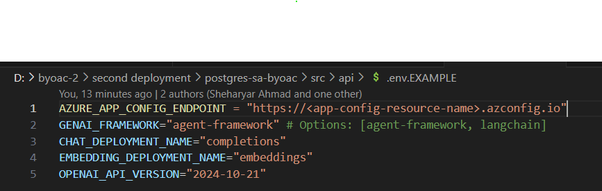
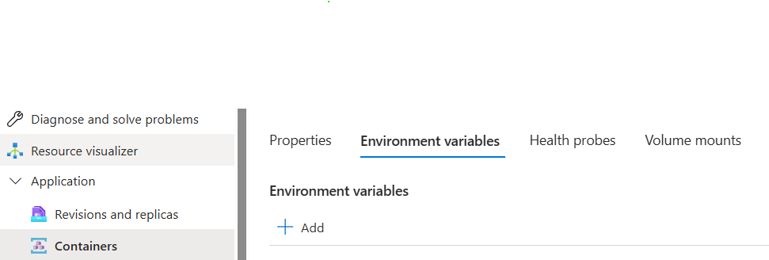

# 2.6 Dev Environment Setup Overview

When running the backend and frontend applications locally, certain development environment setup steps are required. In this step, you will:

- [X] Observe how the dev environment is automatically setup in our application
- [X] Create and populate a `.env` file.

## Automatic Dev Environment Setup

When running the backend and frontend applications locally, the devcontainer must contain the required dependencies. For both the backend and the frontend, the respective dependencies are installed automatically when the apps are launched from the vscode debugger. You do not need to manually install them.

- In `.vscode/tasks.json` file, the tasks are created to install the backend and frontend dependencies:  

    ```json
    {
        "version": "2.0.0",
        "tasks": [
            {
                "label": "Install API Dependencies",
                "type": "shell",
                "command": "pip install -r ${workspaceFolder}/src/api/requirements.txt",
                "problemMatcher": []
            },
            {
                "type": "npm",
                "script": "install",
                "options": {
                    "cwd": "${workspaceFolder}/src/userportal"
                }
            }
        ]
    }
    ```

- These tasks are then invoked in the `.vscode/launch.json`. Observe the **preLaunchTask** key in both the Portal Debugger and the API Debugger:

    ```json
    {
        "version": "0.2.0",
        "configurations": [
            {
                "name": "Portal Debugger",
                "type": "node-terminal",
                "request": "launch",
                "command": "npm run dev",
                "preLaunchTask": "npm: install",
                "cwd": "${workspaceFolder}/src/userportal"
            },
            {
                "name": "API Debugger",
                "type": "debugpy",
                "request": "launch",
                "module": "uvicorn",
                "preLaunchTask": "Install API Dependencies",
                "cwd": "${workspaceFolder}/src/api",
                "args": [
                    "app.main:app",
                    "--reload",
                    "--host", "127.0.0.1",
                    "--port", "8000"
                ],
                "console": "integratedTerminal",
                "jinja": true,
                "env": {
                    "PYTHONPATH": "${workspaceFolder}/usr/bin/python3"
                }
            }
        ]
    }
    ```

Therefore, you don't have to run any commands manually as the required dependencies get installed when the application servers are started from the vscode debugger.

## Create .env file

To run the application locally, you need to create a `.env` file containing the necessary configuration variables that connect your local environment to your Azure resources.

1. Navigate to the `src/api` directory and create a new `.env` file.  
2. Use `src/api/.env.EXAMPLE` as a template to understand the required configuration variables. You need to populate your `.env` file with the actual values of these variables present in your backend azure container environment variables.

    `src/api/.env.EXAMPLE`:
    

    !!! note "Locate Container app environment variables"
        Navigate to your resource group's backend container app. Select **Application** from the left navigation menu. Then select **Containers** and go to the **Environment variables** tab.
        

    - **AZURE_APP_CONFIG_ENDPOINT:** The endpoint for the azure app configuration service. Copy this from the container environment variables.
    - **GENAI_FRAMEWORK:** The AI framework to use for the application. Set this to either `langchain` or `agentframework` based on your preference. Default value is `agentframework`. This variable is not found in the container environment variables and must be manually added to your `.env` file.
    - **CHAT_DEPLOYMENT_NAME:** The name of your Azure OpenAI chat model deployment. Copy this from the container environment variables.
    - **EMBEDDING_DEPLOYMENT_NAME:** The name of your Azure OpenAI embedding model deployment. Copy this from the container environment variables.
    - **OPENAI_API_VERSION:** The API version for Azure OpenAI service calls. Copy this from the container environment variables.
