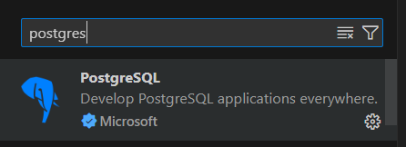
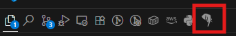
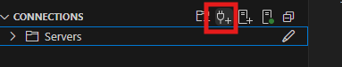
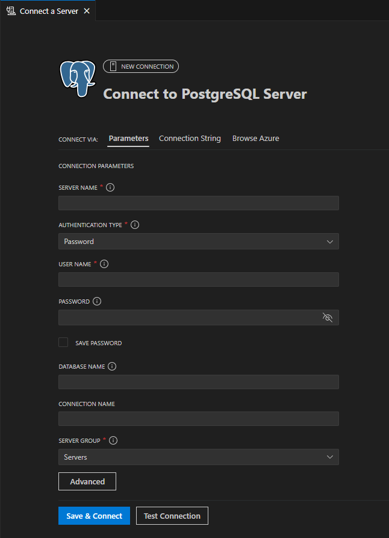
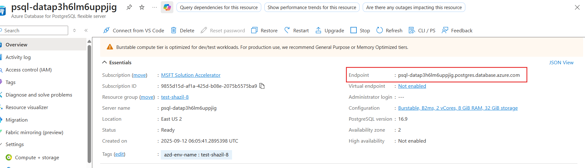
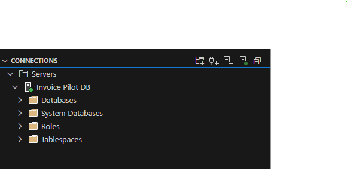

# 2.7 Dev Environment Setup Overview

In this step, you will:

- [X] Observe how the dev environment is automatically setup in our application
- [X] Create and populate a `.env` file
- [X] Connect to the database using PostgreSQL extension.

## Automatic Dev Environment Setup

The required dependencies for both the backend and the frontend of the application are automatically installed when the devcontainer is being built.

In `.devcontainer/post-create-setup.ps1` file:

- The following command installs the backend python dependencies listed in the `src/api/requirements.txt` file.  

```bash
# Install API Python dependencies
pip3 install -r /workspaces/postgres-sa-byoac/src/api/requirements.txt
```

- The following installs the packages required for the frontend.  

```bash
# Install Frontend Node.js dependencies
Write-Host "Installing frontend dependencies..."
Set-Location /workspaces/postgres-sa-byoac/src/userportal
npm install
Write-Host "✅ Frontend dependencies installed"
```

Hence, you don't have to run any commands manually and the required dependencies are already installed when the devcontainer was built.

## Create .env file

To run the application locally, you need to create a `.env` file containing the necessary configuration variables that connect your local environment to your Azure resources.

1. Navigate to the `src/api` directory and create a new `.env` file.  
2. Use `src/api/.env.EXAMPLE` as a template to understand the required configuration variables. Copy these variables to your `.env` file and replace the placeholder values with the actual values from your Azure resource group.

    !!! note "Retrieve the endpoint for your App Configuration resource"
        To get the endpoint for your App Configuration resource:  
        1. Navigate to your App Configuration resource in the [Azure portal](https://portal.azure.com/).  
        2. Select **Access settings** from the resource navigation menu, under **Settings**.  
        3. Copy the **Endpoint** value and paste it into the `.env` file.
            

## Connect to your database using PostgreSQL extension  

You'll use the integrated VS Code PostgreSQL extension for seamless database management and query execution directly within the development environment.

**Installation**  

In our setup, this extension already gets installed when the devcontainer is being built. Nonetheless, to install it manually, search for `Postgres` in the extensions sidebar and install the one developed by Microsoft.



**Connecting with our Database**  

We'll connect the extension to the database server of our application.

1. Click on the PostgreSQL extension

     

2. Select 'add connection' option

     

3. Adding connection details.

    

    - SERVER NAME  
    This is the database endpoint present in the overview tab of your PostreSQL database server instance running in your resource group.
     

    - USER NAME  
    This is your user name or email address that you use to sign in to azure.

    - PASSWORD  
    The password is the token that is generated to login to azure. Run the following command then use the generated token as password

        ```bash
        az account get-access-token --resource-type oss-rdbms --output json
        ```

    - DATABASE NAME  
    The database name that is used is `contracts`.

    - CONNECTION NAME  
    This can be anything. For now, we'll use `Invoice Pilot DB`.

4. Connected
     

The extension is now setup and connected to our database server. This can now be used throughout the guide to interact with the database

!!!tip
    The token which is used as the password expires after some time and hence the connection to the database is terminated then. In such as a case, run the command to generate the token again and connect with the database using the new token.
