# 4.6 Example runs

Here we will go through some example runs to observe the validation and analysis steps.

---

## SOW Validation Passed

This is an example run for a SOW validation that results in `Passed`.

- On the application portal, go to the SOWs tab.  
- Click on `New SOW`. In vendor name, select `Lucerne Publishing`.  
- Upload the `Statement_of_Work_Lucerne_Publishing_Woodgrove_Bank_20241201.pdf` present in the directory `data/sample_docs/Exercise_2_Load_SOW_Invoices/`.

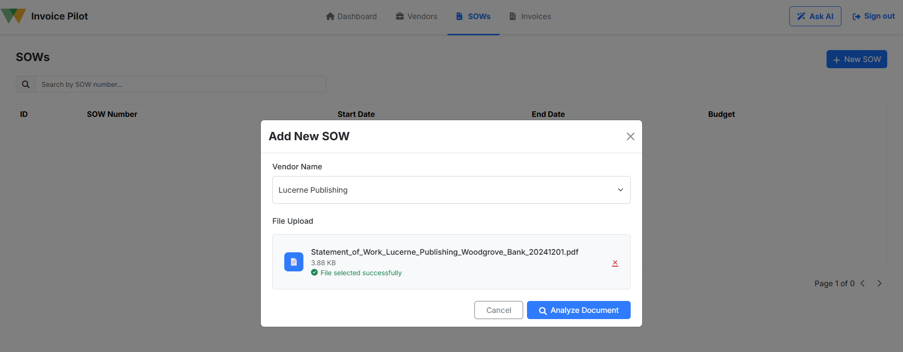

Click on `Analyze Document`. Wait for the analysis and validation steps to complete.

Once completed, you can observe the following output.

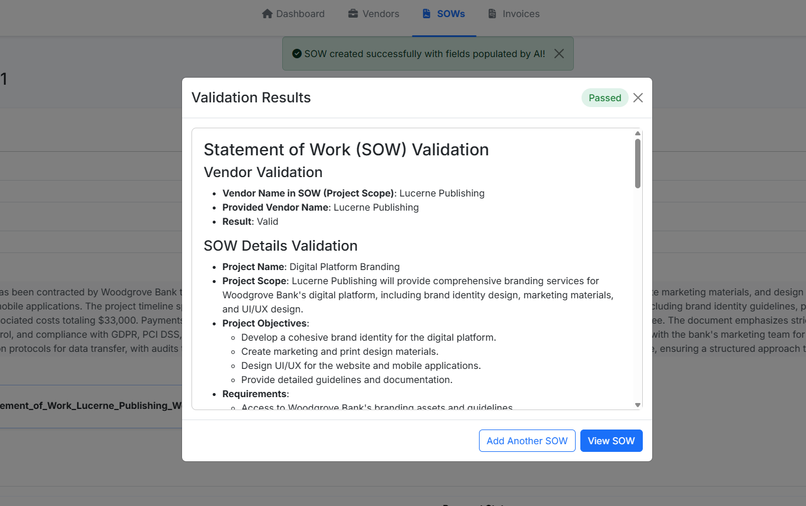

As this particular SOW had no discrepancies, the AI agent has marked this as `Passed`. You can scroll through the validation results.

Close the Validation Results popup. You can now see output of the analysis step. Utilizing the Azure document intelligence service, the relevant information from the SOW is extracted and stored in the corresponding database tables.

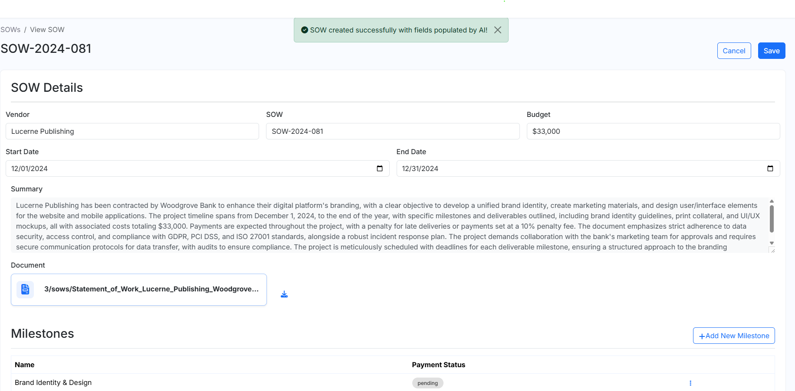

You can edit any information from here, save and then click on `Run Manual Validation` to run only the validation step of the workflow again.

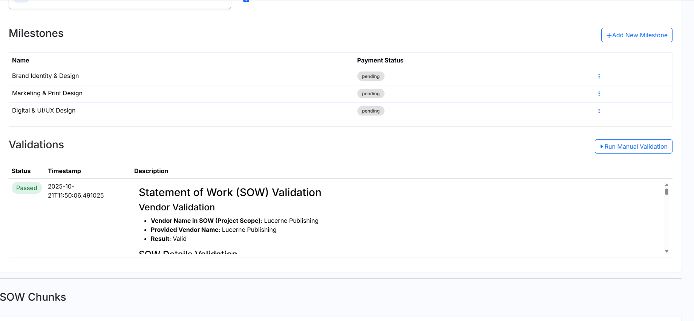

## Invoice Validation Passed

This is an example run for an invoice validation that results in `Passed`.

- On the application portal, go to the Invoices tab.  
- Click on `New Invoice`. In vendor name, select `Lucerne Publishing`.  
- Upload the `INV-LP2024-001.pdf` present in the directory `data/sample_docs/Exercise_2_Load_SOW_Invoices/`.

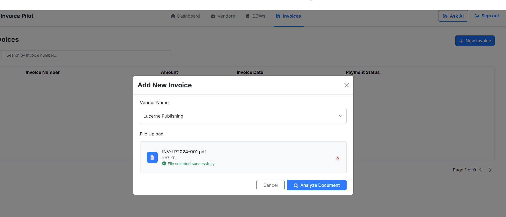

Click on Analyze Document. Wait for the analysis and validation steps to complete.

Once completed, you can observe the following output.

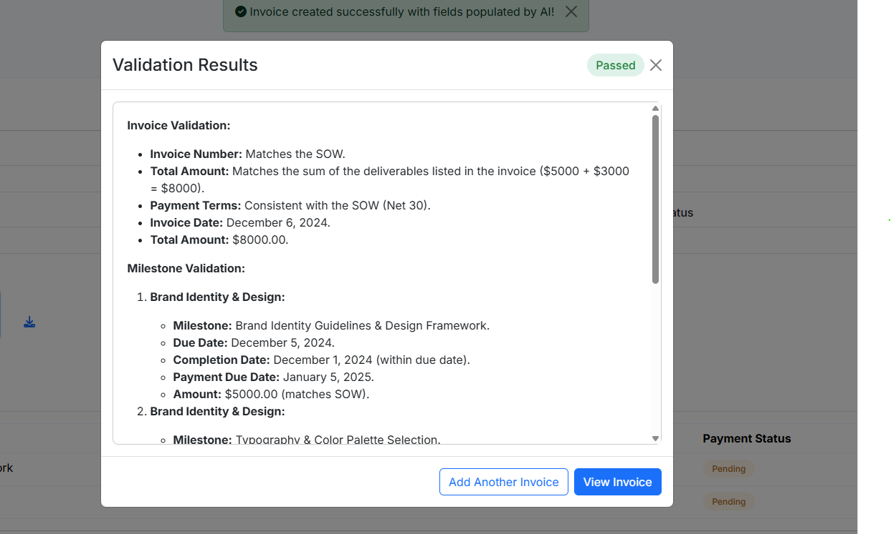

As this particular invoice had no discrepancies, the AI agent has marked this as `Passed`. You can scroll through the validation results.

Close the Validation Results popup. You can now see output of the analysis step. Utilizing the Azure document intelligence service, the relevant information from the invoice is extracted and stored in the corresponding database tables.

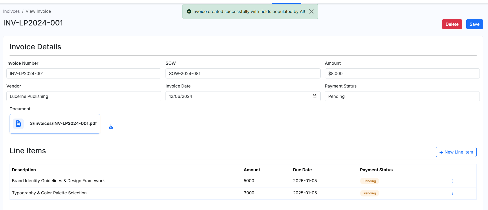

You can edit any information from here, save and then click on `Run Manual Validation` to run only the validation step of the workflow again.

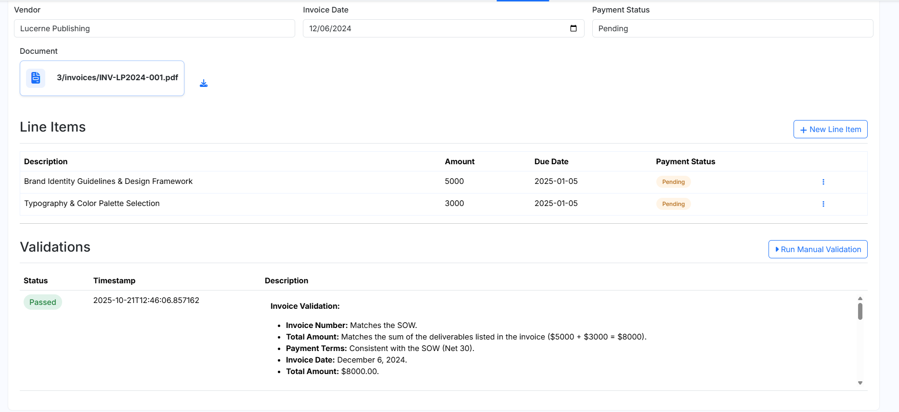

## SOW Validation Failed

This is an example run for a SOW validation that results in `Failed`.

- On the application portal, go to the SOWs tab.  
- Click on `New SOW`. In vendor name, select `VanArsdel, Ltd`.  
- Upload the `Statement_of_Work_VanArsdel_Ltd_Woodgrove_Bank_20231001.pdf` present in the directory `data/sample_docs/Exercise3_Load_Bad_SOWandINV/`.

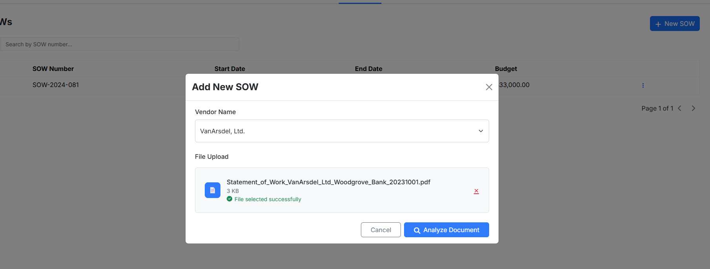

Click on `Analyze Document`. Wait for the analysis and validation steps to complete.

Once completed, you can observe the following output.

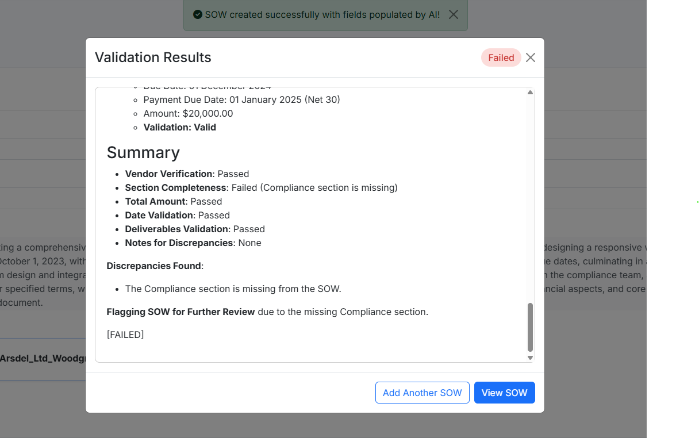

As this particular SOW had discrepancies, the AI agent has marked this as `Failed`. You can scroll through the validation results and observe the discrepancies present.

## Invoice Validation Failed

This is an example run for an invoice validation that results in `Failed`.

- On the application portal, go to the Invoices tab.  
- Click on `New Invoice`. In vendor name, select `VanArsdel, Ltd`.  
- Upload the `INV-VL2024-001.pdf` present in the directory `data/sample_docs/Exercise3_Load_Bad_SOWandINV/`.

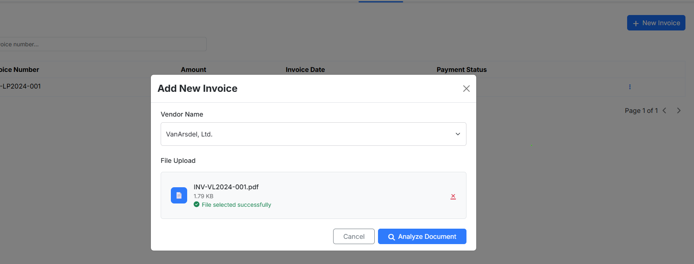

Click on Analyze Document. Wait for the analysis and validation steps to complete.

Once completed, you can observe the following output.

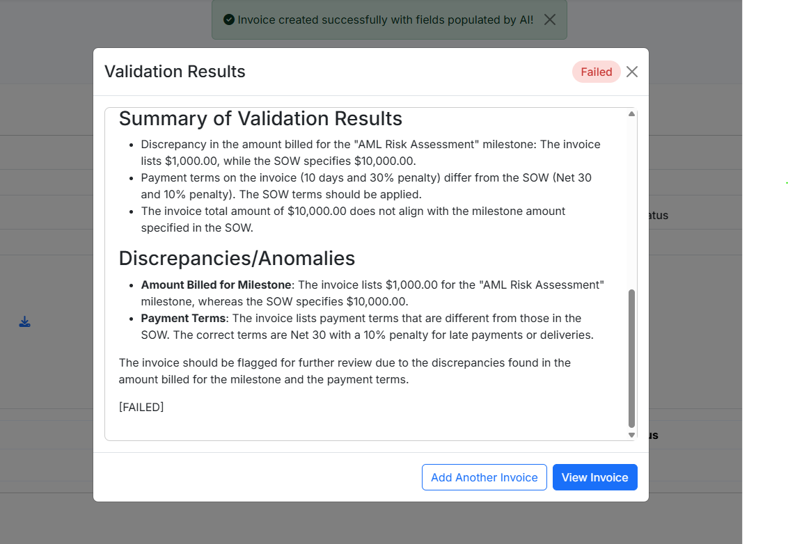

As this particular invoice had discrepancies, the AI agent has marked this as `Failed`. You can scroll through the validation results and observe the discrepancies present.
