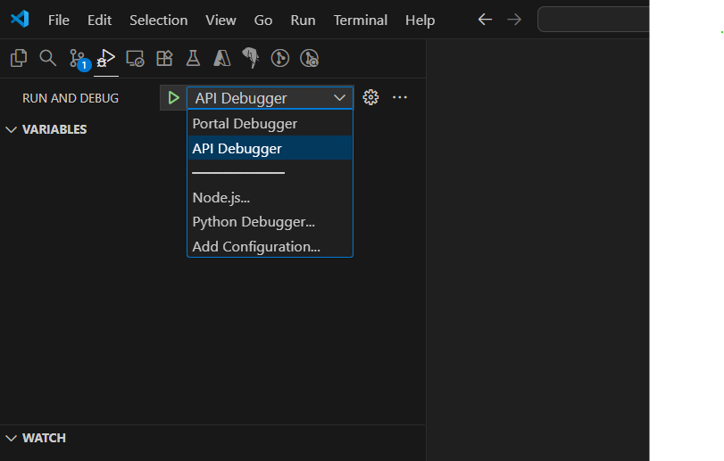
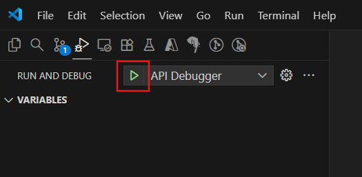
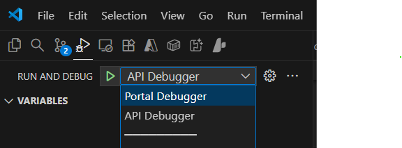
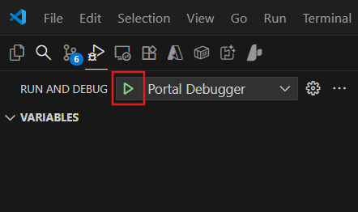
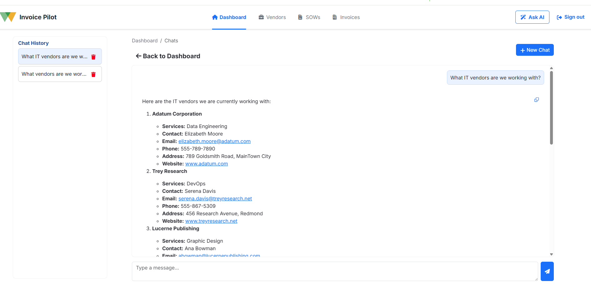
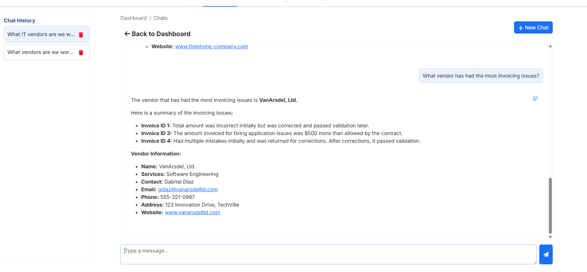

# 5.7 Test the UI Copilot Chat

You are now ready to test the end-to-end copilot chat feature. You must run the FastAPI server and the React SPA locally from VS Code debug sessions. In this next section, you will see how to do this locally for rapid prototyping and testing.

## Test with VS Code

Visual Studio Code provides the ability to run applications locally, allowing for debugging and rapid testing.

### Start the API

The UI relies on the _Woodgrove Bank API_ to be running. As you did to test the API via its Swagger UI, follow the steps below to start a debug session for the API in VS Code.

1. In Visual Studio Code **Run and Debug** panel, select the **API Debugger** option  from the debug configurations dropdown list.

    

2. Select the **Start Debugging** button (or press F5 on your keyboard).

    

3. Wait for the API application to start completely, indicated by an `Application startup complete.` message in the terminal output.

    

### Start the Portal

With the API running, you can start a second debug session in VS Code for the Portal project.

1. Return to the **Run and Debug** panel in Visual Studio Code and select the **Portal Debugger** option from the debug configurations dropdown list.

    

2. Select the **Start Debugging** button (or press F5 on your keyboard).

    

3. This should launch the _Woodgrove Bank Contract Management Portal_ in a new browser window (<http://localhost:3000/>).

4. On the **Dashboard** page, enter the following message into the chat and send it:

    !!! danger "Paste the following prompt in the copilot chat box!"

    ```bash title=""
    What IT vendors are we working with?
    ```

    

5. Next, ask the following question about vendor invoicing accuracy:

    !!! danger "Paste the following prompt in the copilot chat box!"

    ```bash title=""
    What vendor has had the most invoicing issues?
    ```

    

---

!!! success "Congratulations! You have successfully tested the copilot chat feature."
