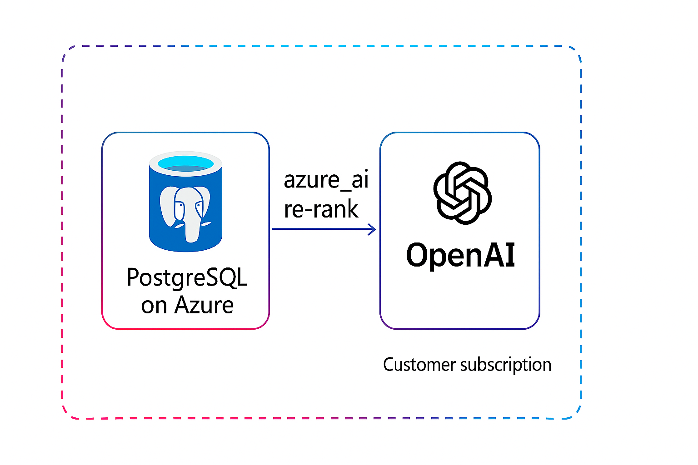

# 6.1 Understand Semantic Ranking

Semantic ranking improves accuracy of the vector search by re-ranking results using a semantic ranker model, which brings more relevant items to the top of the ranked list. In the context of Azure Database for PostgreSQL, _semantic ranking_ can enhance the accuracy and relevance of search results within the database, significantly improving the information retrieval pipelines in Generative AI (GenAI) applications. Unlike vector search, which primarily measures the similarity between two vector embeddings, semantic ranking delves deeper by analyzing the semantic relevance between text strings at the actual text level. This approach ensures that search results are more contextually aligned with user queries, improving information retrieval and higher user satisfaction.

## Reranking Search Results with Semantic Ranker Models

Semantic ranker models compare two text strings: the search query and the text of one of the items being searched. The ranker produces a relevance score that indicates how well the text string matches the query, essentially determining if the text holds an answer to the query. Typically, the semantic ranker is a machine learning model, often a variant of the BERT language model fine-tuned for ranking tasks, but it can also be a large language model (LLM). These ranker models, also called cross-encoder models, take two text strings as input and output a relevance score, usually ranging from 0 to 1.

## Semantic Ranker Model Inference from PostgreSQL

The azure_ai extension provides built-in semantic operators that enable advanced AI-powered search and ranking capabilities directly within PostgreSQL. Instead of requiring external model deployments, the extension offers native semantic ranking functionality through SQL operators.

Using the `azure_ai.rank()` operator, semantic reranking can be performed directly within SQL queries. This operator takes a user query and an array of candidate texts, then uses a large language model (LLM) to evaluate semantic similarity and return relevance scores, allowing for the reranking of vector search results based on semantic relevance rather than relying solely on keyword matching.
