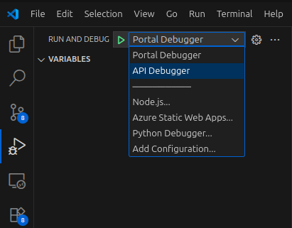
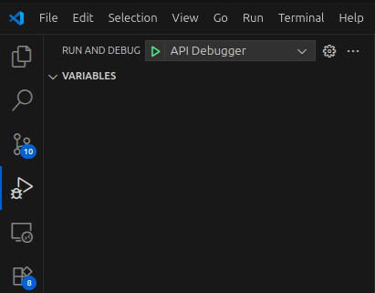
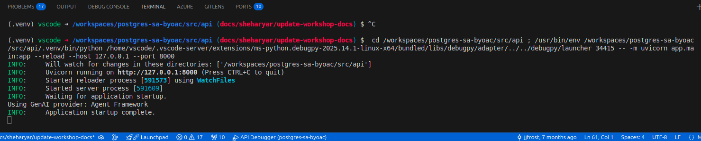
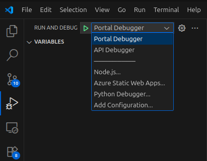
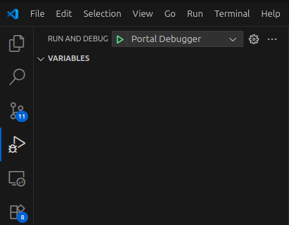

# 6.6 Using GraphRAG in Copilot

This section explores how the copilot uses GraphRAG to retrieve and reason over unpaid invoices using the graph database. The GraphRAG function is made available to the copilot agent as a tool, regardless of whether you use LangChain or AgentFramework for orchestration.

## Review the function

The copilot uses a Python function to execute openCypher queries against the graph database. In `src/api/app/functions/chat_functions.py`, the `get_unpaid_invoices_for_vendor` function retrieves unpaid invoices for a given vendor by querying the graph. Review the function below and explore how it works:

???+ info "GraphRAG code"

    ```python linenums="1" title="src/api/app/functions/chat_functions.py"
    async def get_unpaid_invoices_for_vendor(self, vendor_id: int):
        """
        Retrieves a list of unpaid invoices for a specific vendor using a graph query.
        """
        # Define the graph query
        graph_query = f"""SELECT * FROM ag_catalog.cypher('vendor_graph', $$
        MATCH (v:vendor {{id: '{vendor_id}'}})-[rel:has_invoices]->(s:sow)
        WHERE rel.payment_status <> 'Paid'
        RETURN v.id AS vendor_id, v.name AS vendor_name, s.id AS sow_id, s.number AS sow_number, rel.id AS invoice_id, rel.number AS invoice_number, rel.payment_status AS payment_status
        $$) as (vendor_id BIGINT, vendor_name TEXT, sow_id BIGINT, sow_number TEXT, invoice_id BIGINT, invoice_number TEXT, payment_status TEXT);
        """
        rows = await self.__execute_graph_query(graph_query)
        return [jsonable_encoder(row) for row in rows]
    ```

**How it works:**

1. **Defines a Cypher query** to look up unpaid invoices for the specified `vendor_id`.
2. **Executes the Cypher query** using the `__execute_graph_query()` helper, which ensures the query runs against the correct schema.
3. **Returns the results** as a list of dictionaries for the LLM to use.

## GraphRAG as a Copilot Tool

The `get_unpaid_invoices_for_vendor` function is registered as a tool for the copilot agent. Whether you are using LangChain or AgentFramework, this function is included in the agent's toolset, enabling the copilot to answer questions about unpaid invoices by leveraging the graph structure. This integration is framework-agnostic and ensures that the copilot can reason over graph data regardless of the orchestration framework you choose.

## Test with VS Code

You can test the copilot's GraphRAG capabilities using Visual Studio Code:

### Start the API

1. In Visual Studio Code **Run and Debug** panel, select the **API Debugger** option for your OS from the debug configurations dropdown list.

    

2. Select the **Start Debugging** button (or press F5 on your keyboard).

    

3. Wait for the API application to start completely, indicated by an `Application startup complete.` message in the terminal output.

    

### Start the Portal

1. With the API running, return to the **Run and Debug** panel in Visual Studio Code and select the **Portal Debugger** option from the debug configurations dropdown list.

    

2. Select the **Start Debugging** button (or press F5 on your keyboard).

    

3. This should launch the _Invoice Pilot Portal_ in a new browser window (<http://localhost:3000/>).

### Try GraphRAG in the Copilot Chat

On the **Dashboard** page, enter the following message in the copilot chat and send it:

!!! danger "Paste the following prompt into the copilot chat box!"

    ```ini title=""
    Tell me about the accuracy of unpaid invoices from Adatum.
    ```

Observe the results provided using GraphRAG.

!!! tip "GraphRAG improves accuracy"

    Add a breakpoint in the `get_unpaid_invoices_for_vendor` function in the `chat_functions.py` file. The breakpoint will allow you to see the graph query executing and enable you to step through the remaining function calls to observe that the invoice validation results are only retrieved for the unpaid invoices. This precision reduces the data returned from the database and allows the RAG pattern to only receive the data it needs to generate a response.

!!! success "Congratulations! You just learned how GraphRAG enables your copilot to reason over graph data in Azure Database for PostgreSQL and AGE!"
